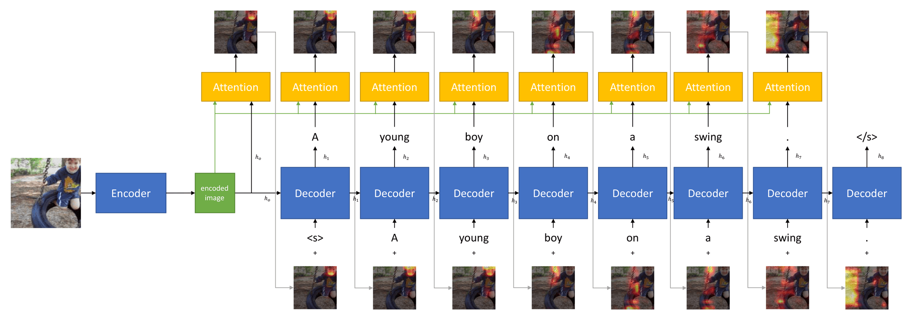

# What is this about?
This repository has been created to enhance collaboration and document the results of the project in the lecture "Neural Networks and Sequence to Sequence Learning".
The aim is to implement image captioning using primarily the pytorch machine translation framework [JoeyNMT](https://github.com/joeynmt/joeynmt).
As baseline model we implement the approach of [Xu et al. (2015)](http://arxiv.org/abs/1502.03044).

# Visit our Demo
You can let our best-performing model generate captions for any image [here](https://image2caption.pascalperle.de/).

  

# Model Architecture
Just like [Xu et al. (2015)](http://arxiv.org/abs/1502.03044) we use an encoder network to retrieve features from images. The feature vector is then used to initialize a LSTM decoder, which unrolls a generated caption. For each step, an attention mechanism is applied on the feature vector. The attention mechanism is illustrated below using a real example and shows how our implementation attends to different areas of the image during unrolling.  

# Usage
## Training
1. Make sure to install dependencies listed in requirements.txt.
2. In order to work with our implementation, load the Flickr8k dataset from https://github.com/goodwillyoga/Flickr8k_dataset.
3. Place the files ``Flickr8k.token.txt``, ``Flickr8k.trainImages.txt``, ``Flickr8k.devImages.txt``, ``Flickr8k.testImages.txt``, the ``ExpertAnnotations.txt`` file as well as the folder containing all images in a ``data`` folder in project root.
4. Adapt the location and name of the above mentioned files in train.py, if necessary.
5. Create a .yaml file in the ``param`` folder in project root. You should give this file a meaningful name. Define in the file all parameters of the experiment you want to execute. An example .yaml file with explanations can be found in the ``param`` folder of this repository.
6. Start training: ``python train.py modelname``. Set ``model_name`` to the name given to the .yaml file containing the desired training parameters.
7. During training, the loss and BLEU score evaluations on the train data will be stored inside a ``runs`` folder, named accoring to the model name given before. These data points can easily be visualized using Tensorboard. The trained model is stored as a ``.pth`` file in the folder ``saved_models``.

## Evaluation on Test Set
1. Make sure the .pth file of the model you want to evaluate exists in the ``saved_models`` folder.
2. In ``eval.py``, change the ``model_name`` to the name of a .yaml file containing the same entries as the trainining file and additionally the entry ``load_model``, set to the path of the .pth file. Example: ``load_model: 'saved_models/best_model.pth'``
3. Start evaluating with ``python eval.py``. Evaluation will be done using the test split and results will be put out to the console.

## Best Model
Our best-performing model's weights can be downloaded [here](https://drive.google.com/file/d/1xbtV0X_I9vL1Ph2YGZCIUo6VxB7ZIk0z/view?usp=sharing).
